Link
===
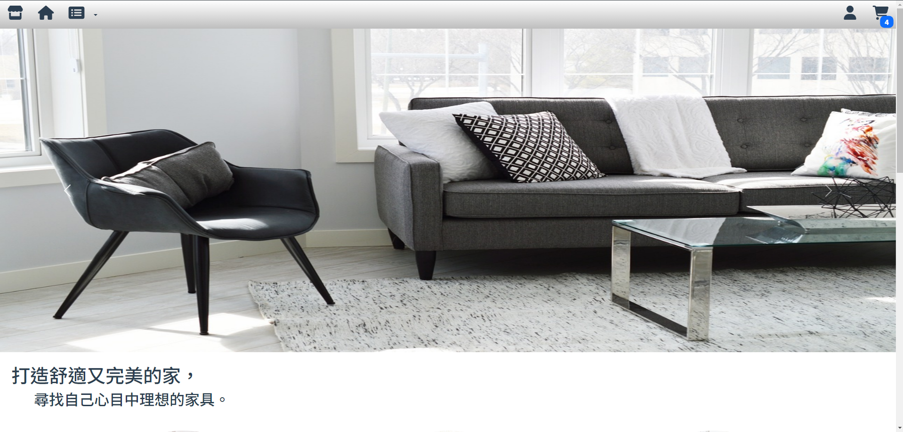

簡介:
---

 ### 此SPA電商網站使用Vue CLI為專案架構製作，透過Bootstrap使用Class進行CSS樣式設計及RWD響應式網頁設計，Vuex儲存並使用共同資料，Vue Router控制路由頁面切換，由Axios發出請求並提供後端資料，再由PHP PDO連線至MySQL資料庫進行SQL CRUD並取得需要的資料處理後回傳。

開發技術:
---

- ### Vue.js(Composition API)
- ### PHP
- ### Bootstrap(v5.2)
- ### MySQL
- ### Axios

功能介紹:
---

## 1. 購物車
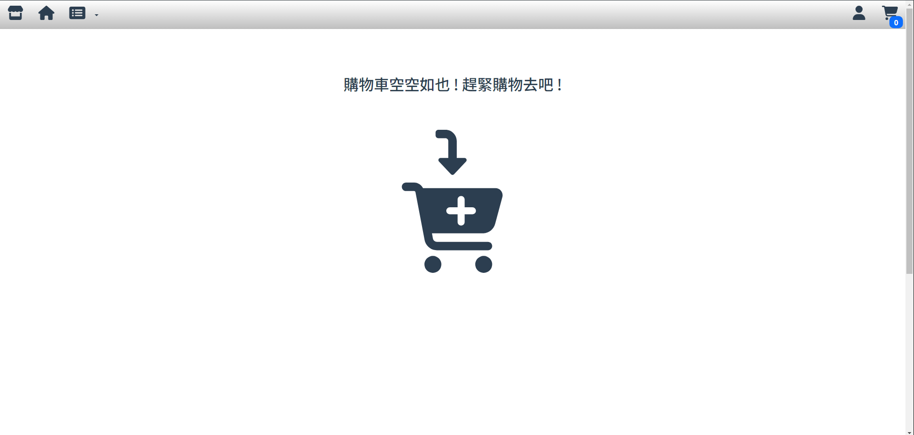
- ### 使用Local Storage儲存待購商品
    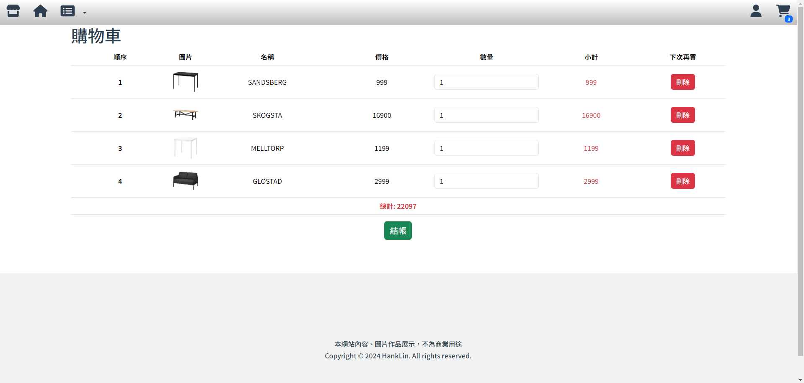
- ### 商品數量增加/刪除
    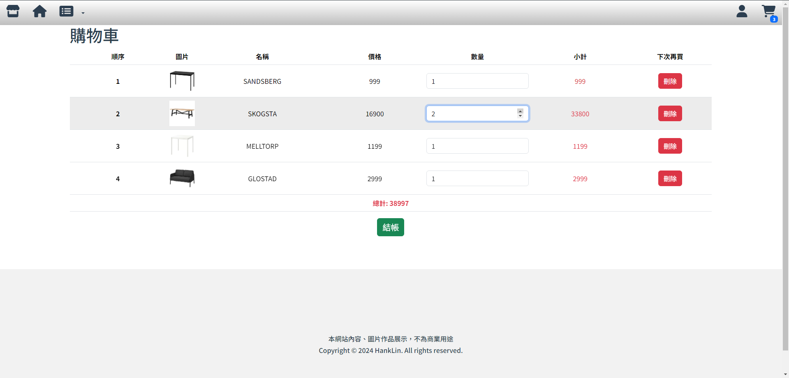
## 2. 登入
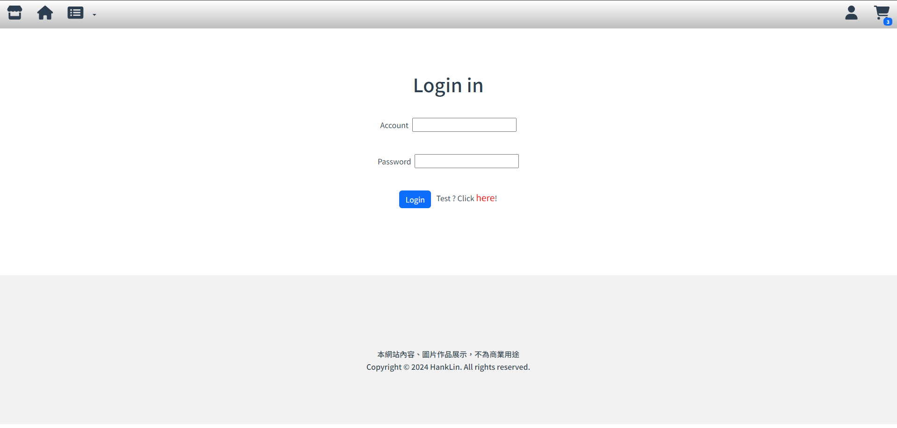
- ### 會員資料更改
    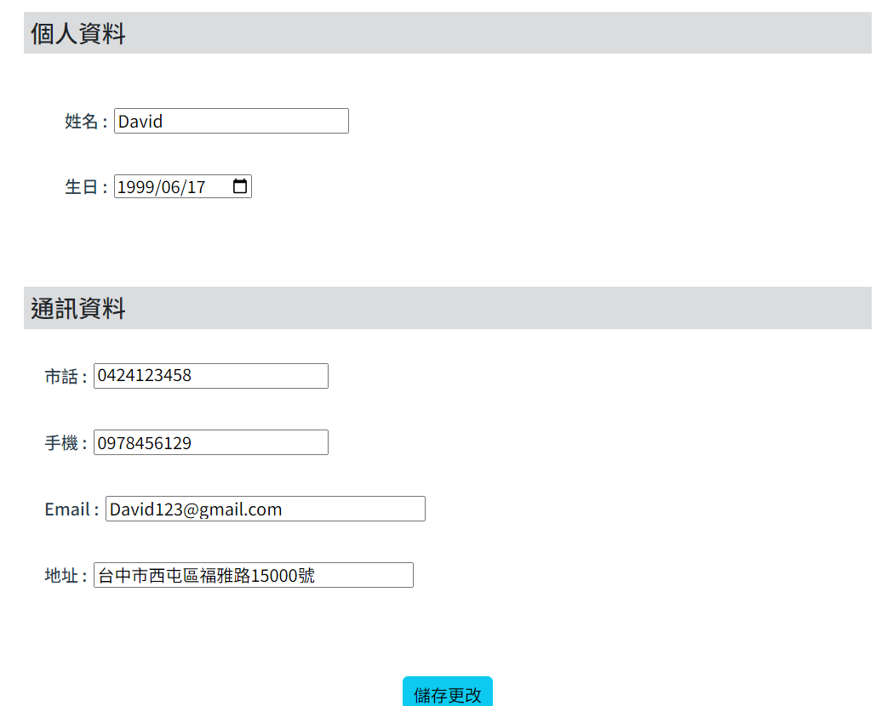
- ### 訂單總覽及訂單詳細
    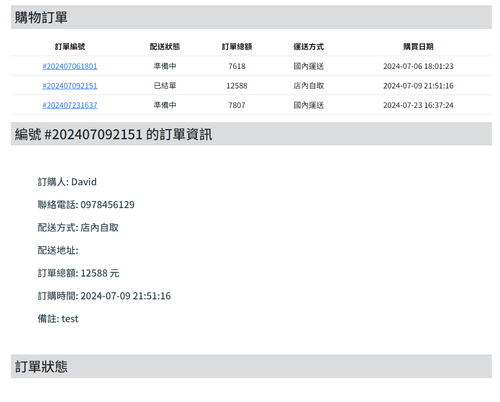
- ### 購物車進行下訂
    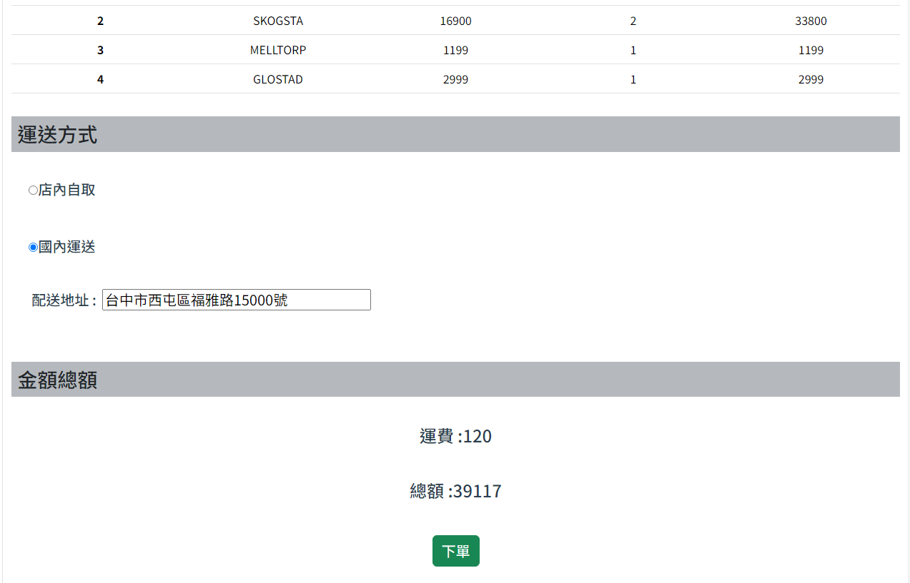
## 3. 關鍵字搜尋
- ### 透過商品類型/顏色/尺寸進行搜尋
    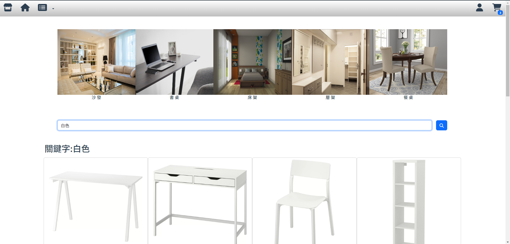
## 4. 路由切換
- ### 切換指定頁面(主頁、商品頁、登入..等)
    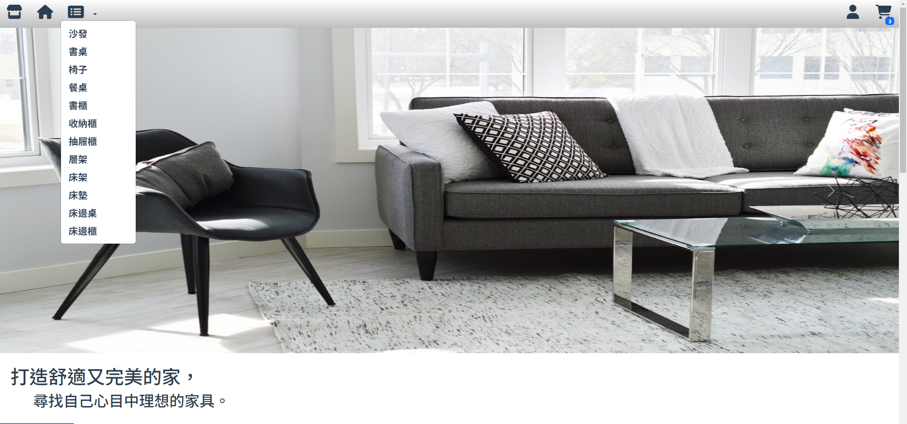
- ### 路由阻擋切換(結帳前進行登入確認)
    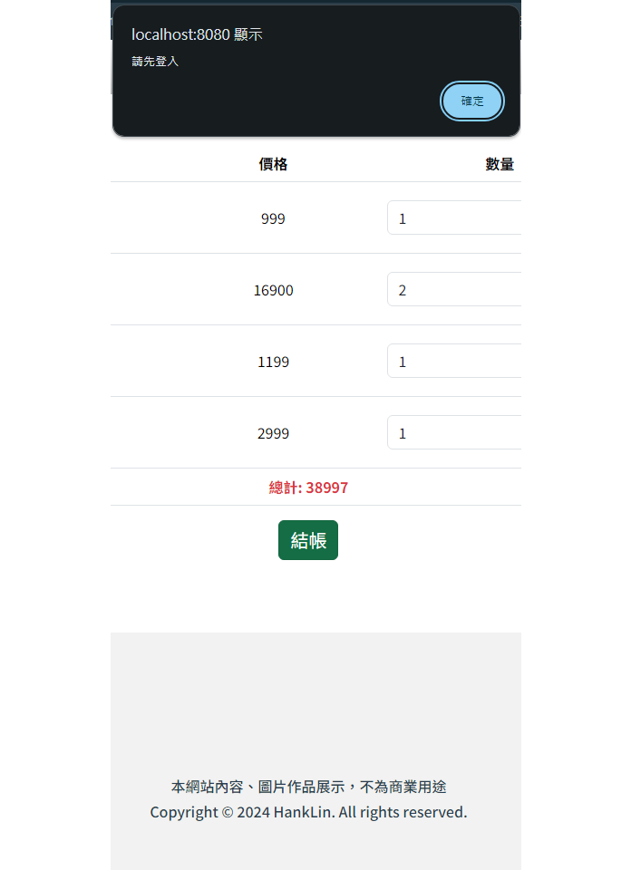
## 5. 商品頁

- ### 透過Sidebar切換至指定類別
    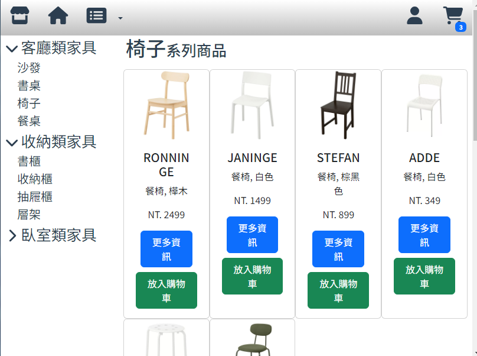
- ### 點選圖片切換瀏覽圖片
    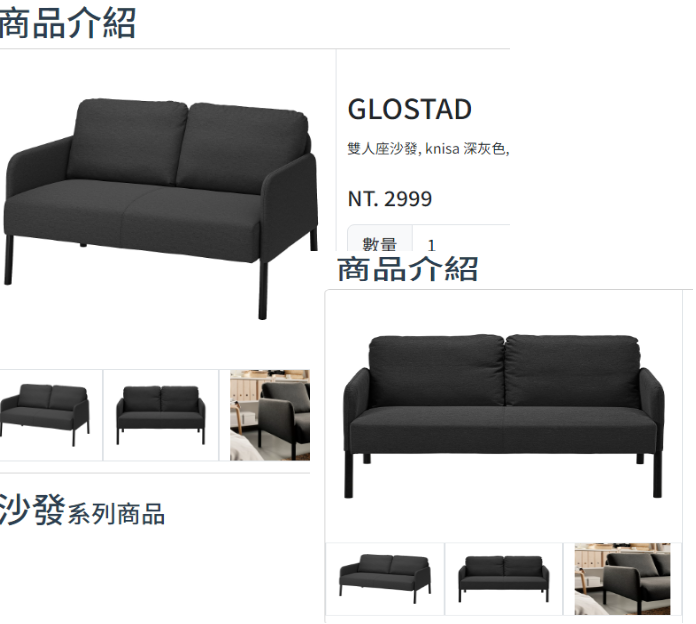
- ### 根據瀏覽器長寬變更呈現商品的數量(RWD)
    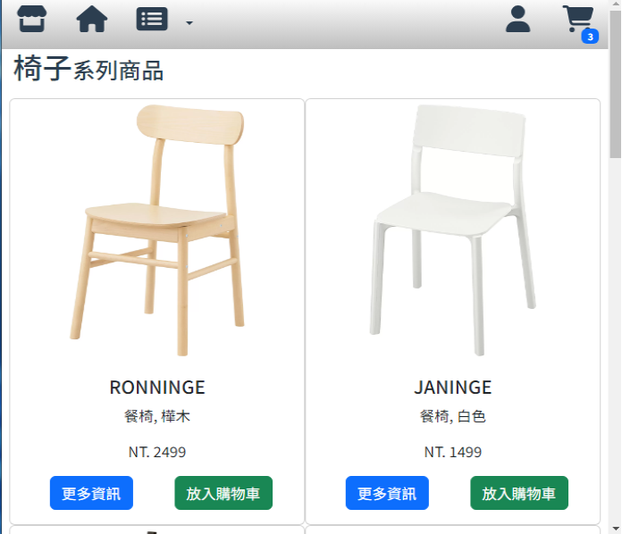
    
圖片/資料聲明:
---
本網站使用的圖片/資料僅為作品展示，不會作為商品用途。
